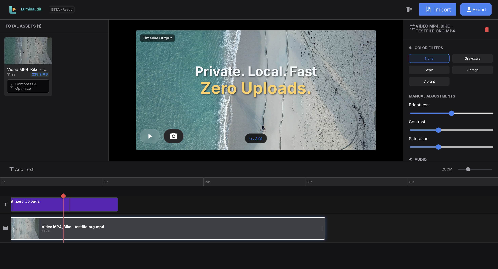

# LuminaEdit – Browser‑Based Video Editor

**Live demo:** https://ashishcumar.github.io/luminaEdit/

## Features Implemented

- **Instant file import** – Files are streamed directly into the Origin‑Private File System (OPFS) without loading the whole file into memory.
- **Metadata hydration** – Duration, thumbnail and size are extracted in a Web Worker using FFmpeg‑Wasm.
- **Rich timeline UI** – Tracks with draggable clips, text overlays, zoom control and a playhead marker. The ruler now starts after the track‑label icons.
- **Compression** – Hardware‑accelerated compression via WebCodecs when supported, otherwise fallback to FFmpeg‑Wasm.
- **Export** – Concatenates clips and overlays into an MP4 file entirely in‑browser.
- **Persistent storage** – Uses IndexedDB (Dexie) and OPFS; requests persistent quota and handles incognito limits.
- **Modular architecture** – Core logic lives in a dedicated Web Worker (`processor.worker.ts`), UI components are isolated, and utilities (`opfs.ts`, `webcodecs.ts`) keep side‑effects separate.

## Tech Stack

- **React + TypeScript** for UI
- **Vite** for fast bundling and HMR
- **FFmpeg‑Wasm** for video processing
- **WebCodecs API** for hardware‑accelerated encoding/compression
- **IndexedDB (Dexie)** + **OPFS** for client‑side storage
- **MUI icons** 

